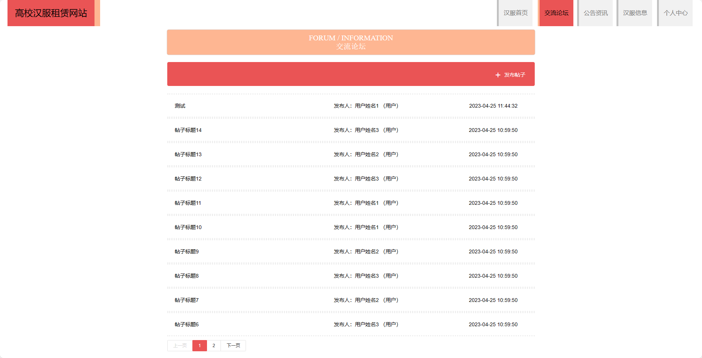

基于Springboot的高校汉服租赁网站（程序+论文）
=
### 完整代码获取地址：从戎源码网 ([https://armycodes.com/](https://armycodes.com/))
### 作者微信：19941326836  QQ：952045282 
### 承接计算机毕业设计、Java毕业设计、Python毕业设计、深度学习、机器学习
### 选题+开题报告+任务书+程序定制+安装调试+论文+答辩ppt 一条龙服务
### 所有选题地址https://github.com/nature924/allProject

一、项目介绍
---
基于Spring Boot框架实现的高校汉服租赁网站，系统包含两种角色：管理员、用户,系统分为前台和后台两大模块，主要功能如下。
### 前台：
1. 汉服首页：展示网站的主页。
2. 交流论坛：提供一个汉服爱好者的交流平台。
3. 公告资讯：发布网站相关的公告和资讯。
4. 汉服信息：展示各种类型的汉服。
5. 个人中心：用户可以管理个人信息。

### 后台：
### 管理员：
1. 个人中心：管理员可以管理个人信息，包括修改密码、查看个人资料等。
2. 管理员管理：管理员可以对其他管理员进行管理，包括添加、编辑、删除管理员账号等操作。
3. 用户管理：管理员可以对用户进行管理，包括查看用户列表、禁用用户账号等操作。
4. 汉服信息管理：管理员可以管理汉服的信息，包括添加、编辑、删除汉服信息等操作。
5. 交流论坛管理：管理员可以管理交流论坛的帖子和评论，包括审核、删除不当内容等操作。
6. 公告资讯管理：管理员可以管理公告资讯的发布和编辑，包括添加、编辑、删除公告等操作。
7. 基础数据管理：管理员可以管理网站的基础数据，包括汉服分类、活动标签等的添加、编辑、删除等操作。
8. 轮播图信息：管理员可以管理网站首页的轮播图信息，包括添加、编辑、删除轮播图等操作。

二、项目技术
---
- 编程语言：Java
- 数据库：MySQL
- 项目管理工具：Maven
- 前端技术：VUE、HTML、Jquery、Bootstrap
- 后端技术：Spring、SpringMVC、MyBatis

三、运行环境
---
- 操作系统：Windows、macOS都可以
- JDK版本：JDK1.8以上都可以
- 开发工具：IDEA、Ecplise、Myecplise都可以
- 数据库: MySQL5.7以上都可以
- Tomcat：任意版本都可以
- Maven：任意版本都可以

四、运行截图
---
### 论文截图：

### 程序截图：

